export { default as theme } from './theme'

import { Image } from 'mdx-deck'
import { CodeSurfer } from 'mdx-deck-code-surfer'
import oceanicNext from 'prism-react-renderer/themes/oceanicNext'

# Making a GroupMe Bot With Node.js and Heroku

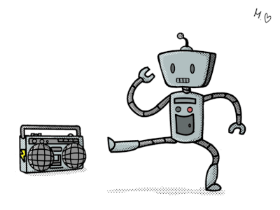

---

# Fork the Repository

[github.com/TomerAberbach/groupme-bot-tutorial](https://github.com/TomerAberbach/groupme-bot-tutorial)

Press the "Fork" button on the top-right.

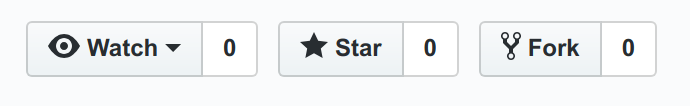

---

# Sign Up For Heroku

We'll be running our code on their servers.

[signup.heroku.com/login](https://signup.heroku.com/login)

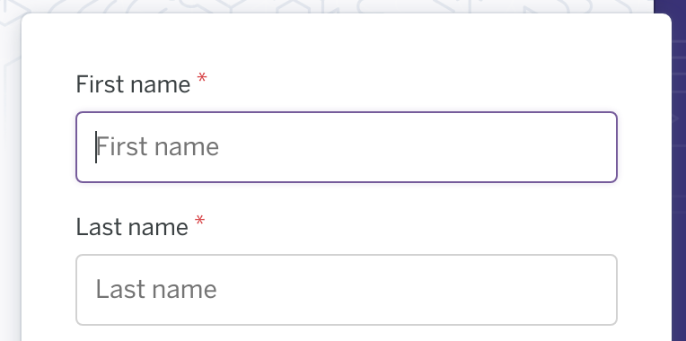

---

# Create an App

[dashboard.heroku.com](https://dashboard.heroku.com/apps)

Click on 'Create new app'.

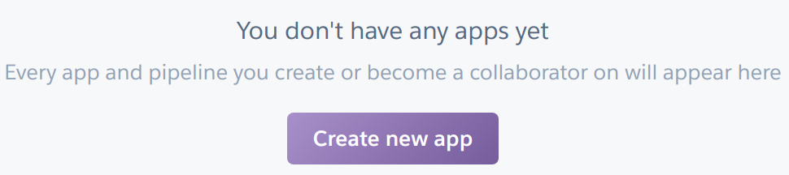

---

# Create an App

Give your app a name, then click on 'Create app'.

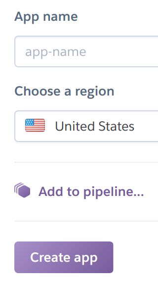

---

# Connect to GitHub

Click on the GitHub icon.

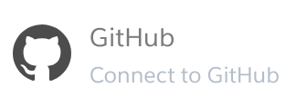

---

# Connect to GitHub

Click on 'Connect to GitHub' and follow the prompts.

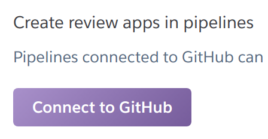

---

# Connect the Repository

Type 'groupme-bot-tutorial' into the search bar, then press enter.

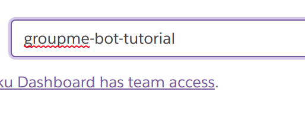

---

# Connect the Repository

Click on 'Connect' for the repository you forked.

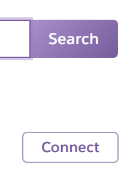

---

# Go to Settings

Click on 'Settings'. 

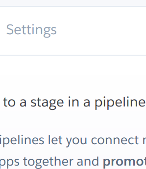

---

# Edit Configuration Variables

Click on 'Reveal Config Vars'.


---

# Login to GroupMe Development

In a separate tab: [dev.groupme.com/session/new](https://dev.groupme.com/session/new)

Then sign in with your GroupMe credentials.

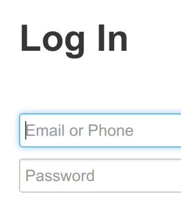

---

# Get Your GroupMe Access Token

Click on 'Access Token', and then copy your access token from the pop-up.

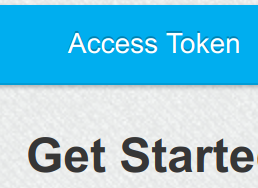

---

# Set Your GroupMe Access Token

Back in Heroku, type 'ACCESS_TOKEN' in the first 'VALUE' box.

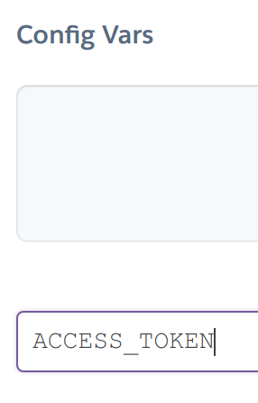

---

# Set Your GroupMe Access Token

Paste your copied access token in the second 'VALUE' box.

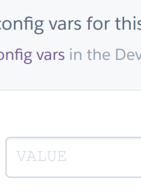

---

# Set Your GroupMe Access Token

Click on 'Add'.

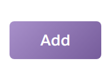

---

# Register Your GroupMe Bot

Scroll down the page and copy your domain URL.

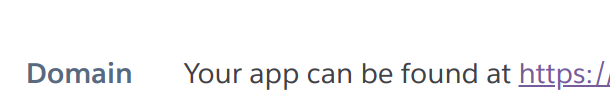

---

# Register Your GroupMe Bot

Back in GroupMe Development, click on 'Bots'.


---

# Register Your GroupMe Bot

Click on 'Create Bot'.

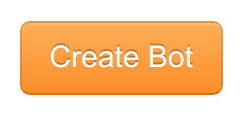

---

# Register Your GroupMe Bot

Paste your copied domain URL in the 'Callback URL' box.

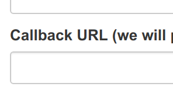

---

# Register Your GroupMe Bot

Click on 'Submit'.

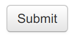

---

# Get Your Bot ID

Click on the bot you just created in the 'Bot' menu.

---

# Get Your Bot ID

Copy your bot ID.

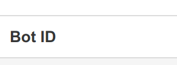

---

# Set Your Bot ID

Back in Heroku, type 'BOT_ID' in the next available 'VALUE' box.

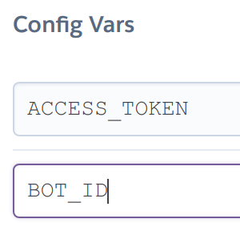

---

# Set Your Bot ID

Paste your copied bot ID in the second 'VALUE' box.

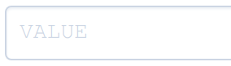

---

# Set Your Bot ID

Click on 'Add'.


---

# Deploy Your Bot

Click on 'Deploy'.

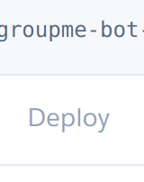

---

# Deploy Your Bot

Click on 'Deploy Branch'.


---

# Test the Bot

Send the following message in the GroupMe chat containing your bot:

```
I have mixed feelings about bots...
```

And observe the result!

---

# What Did We Deploy?

Let's first identify the actors involved.

---

# The Situation

We need to understand how our code will interact with GroupMe and its users.

---

<Image src="img/situation/1.svg" width="90vw" height="90vh" />

---

<Image src="img/situation/2.svg" width="90vw" height="90vh" />

---

<Image src="img/situation/3.svg" width="90vw" height="90vh" />

---

<Image src="img/situation/4.svg" width="90vw" height="90vh" />

---

<Image src="img/situation/5.svg" width="90vw" height="90vh" />

---

# What is a Request?

Requests serve as a way for a *client* and a *server* to interact.

The client *sends* the request and the server *responds* to it.

---

# Our Server Will Play Both Roles

When GroupMe passes along a message from the user, it will be the client and our server will be the server.

When our server sends a response to GroupMe, GroupMe will be the server and our server will play the part of the client.

---

<CodeSurfer
  title="bot.js"
  code={require("!raw-loader!../bot.js")}
  theme={oceanicNext}
  lang="javascript"
  showNumbers={true}
  dark={false}
  steps={[
    { range: [1, 99] },
    { range: [1, 2] },
    { range: [4, 52] },
    { range: [4, 17] },
    { range: [18, 51] },
    { range: [54, 94] },
    { range: [54, 79] },
    { range: [80, 93] },
    { range: [96, 99] }
  ]}
/>

---

<CodeSurfer
  title="server.js"
  code={require("!raw-loader!../server.js")}
  theme={oceanicNext}
  lang="javascript"
  showNumbers={true}
  dark={false}
  steps={[
    { range: [1, 104] },
    { range: [1, 2] },
    { range: [3, 5] },
    { range: [7, 24] },
    { range: [25, 30] },
    { range: [85, 94] },
    { range: [31, 37] },
    { range: [39, 52] },
    { range: [39, 46] },
    { range: [47, 51] },
    { range: [54, 83] },
    { range: [54, 59] },
    { range: [60, 67] },
    { range: [69, 77] },
    { range: [79, 82] },
    { range: [98, 104] }
  ]}
/>
